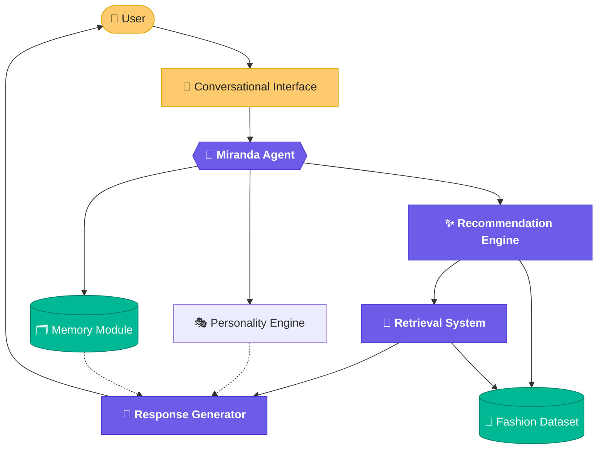
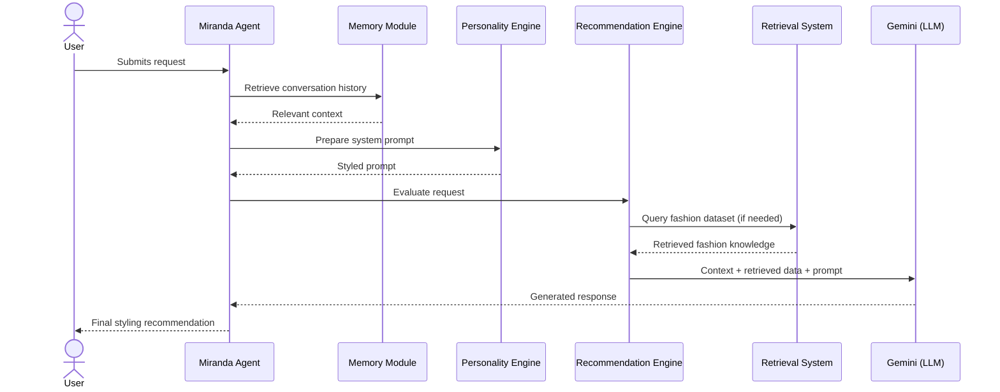
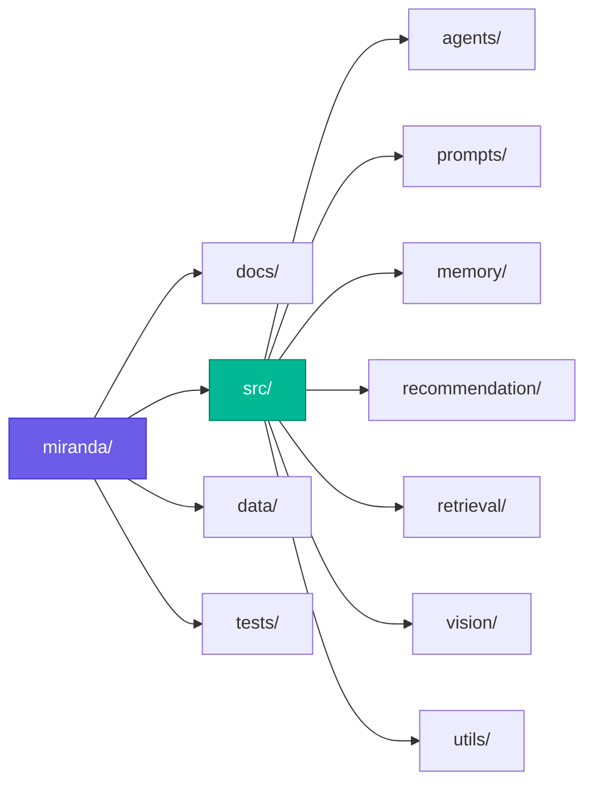
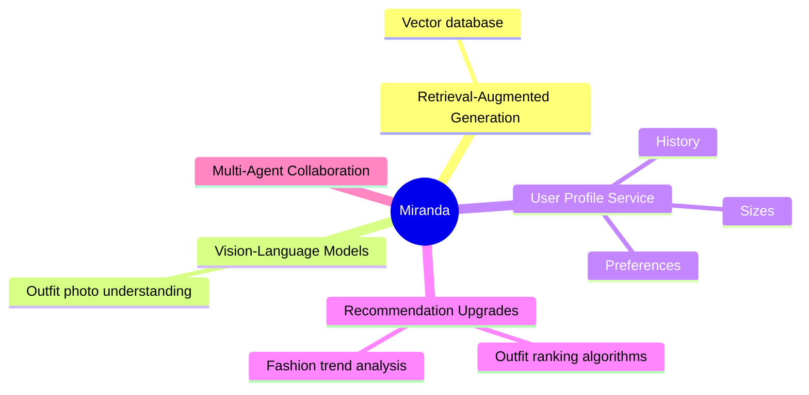

# 🧵 Miranda — System Architecture

  
  
  
  

An AI-powered conversational fashion assistant — modular by design, stylist by nature.

 

## 📖 Purpose

This document describes the overall architecture of **Miranda**, an AI-powered conversational fashion assistant. It explains the major software components, how they interact, and how the system is intended to evolve over time.

The goal is to give anyone approaching this codebase a clear mental model **before** diving into implementation details.

 

## 🎯 Project Overview

Miranda is designed as a **modular AI agent** capable of understanding user requests, maintaining conversational context, retrieving relevant fashion information, and generating personalized styling recommendations.

Rather than relying solely on a Large Language Model, Miranda combines several specialized components — memory management, retrieval, recommendation logic, and structured fashion data — each with a single, well-defined job.

> The architecture emphasizes **modularity**, **maintainability**, and **future scalability**.

 

## 🏗️ High-Level Architecture

 

## 🧩 Core Components

### 1. User Interface

The interface through which users interact with Miranda.

| Status | Interface |
|---|---|
| ✅ Current | Command Line Interface (CLI) |
| 🔜 Planned | Web application |
| 🔜 Planned | Mobile application |
| 🔜 Planned | Voice interface |

---

### 2. Miranda Agent

The **central controller** of the system — the orchestration layer connecting all major components.

Responsibilities:
- Receiving user requests
- Coordinating system modules
- Managing conversation flow
- Constructing prompts
- Returning responses

---

### 3. Personality Engine

Defines Miranda's conversational identity — the difference between *"a chatbot that knows about clothes"* and *"a stylist you'd actually trust."*

Responsibilities:
- Tone of voice
- Styling philosophy
- Prompt templates
- Behavioral rules
- Response consistency

---

### 4. Memory Module

Stores conversational context so Miranda doesn't forget who it's talking to mid-conversation.

| Status | Capability |
|---|---|
| ✅ Current | Session-based memory |
| 🔜 Planned | Long-term memory |
| 🔜 Planned | User preferences |
| 🔜 Planned | Favorite brands |
| 🔜 Planned | Size information |
| 🔜 Planned | Wardrobe history |
| 🔜 Planned | Style evolution |

---

### 5. Recommendation Engine

The component responsible for turning context into concrete styling advice.

**Inputs:** user preferences · occasion · budget · weather · fashion dataset

**Outputs:** outfit recommendations · styling advice · alternative options · explanation of recommendations

---

### 6. Retrieval System

Gives Miranda factual, grounded fashion knowledge rather than relying purely on model recall.

Planned responsibilities:
- Searching product catalogs
- Retrieving clothing information
- Similar-outfit search
- Retrieval-Augmented Generation (RAG)

---

### 7. Fashion Dataset

The structured repository of clothing items that powers recommendations.

Example attributes: `product name` · `category` · `color` · `brand` · `material` · `season` · `style` · `price`

 

## 🔄 Data Flow

The sequence below illustrates how a typical interaction is processed, end to end.

 

## 📁 Project Structure

| Path | Responsibility |
|---|---|
| `docs/` | Documentation |
| `src/agents/` | Agent orchestration |
| `src/prompts/` | Prompt templates |
| `src/memory/` | Memory management |
| `src/recommendation/` | Recommendation algorithms |
| `src/retrieval/` | Fashion search and retrieval |
| `src/vision/` | Computer vision modules |
| `src/utils/` | Shared utilities |
| `data/` | Fashion datasets |
| `tests/` | Automated testing |

 

## 🛠️ Technology Stack

| Layer | Technology |
|---|---|
| Programming Language | Python |
| LLM | Google Gemini |
| Agent Framework | Google ADK |
| Dataset | Kaggle Fashion Product Dataset |
| Data Processing | Pandas |
| Machine Learning | Scikit-learn |
| Computer Vision *(future)* | OpenCV |
| Embeddings *(future)* | Sentence Transformers |
| Version Control | Git |

 

## 🚧 Future Architecture

The current architecture is intentionally modular to support future extensions **without significant rework**.

 

## 🧭 Design Principles

| Principle | Meaning |
|---|---|
| **Modularity** | Each component performs a single responsibility |
| **Scalability** | New components integrate without major refactoring |
| **Maintainability** | Code stays organized and easy to understand |
| **Reusability** | Modules are reusable across future projects |
| **Extensibility** | Future AI capabilities are added with minimal disruption |

 

Miranda — styled by design, engineered for growth. 🧷

