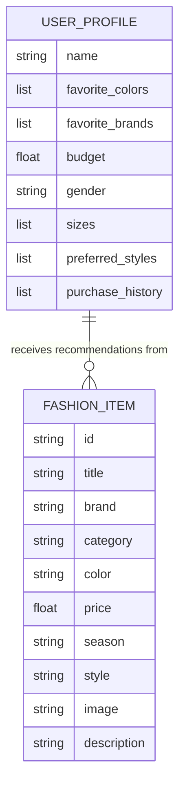
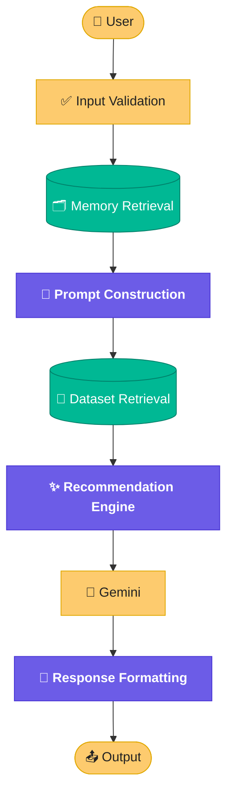
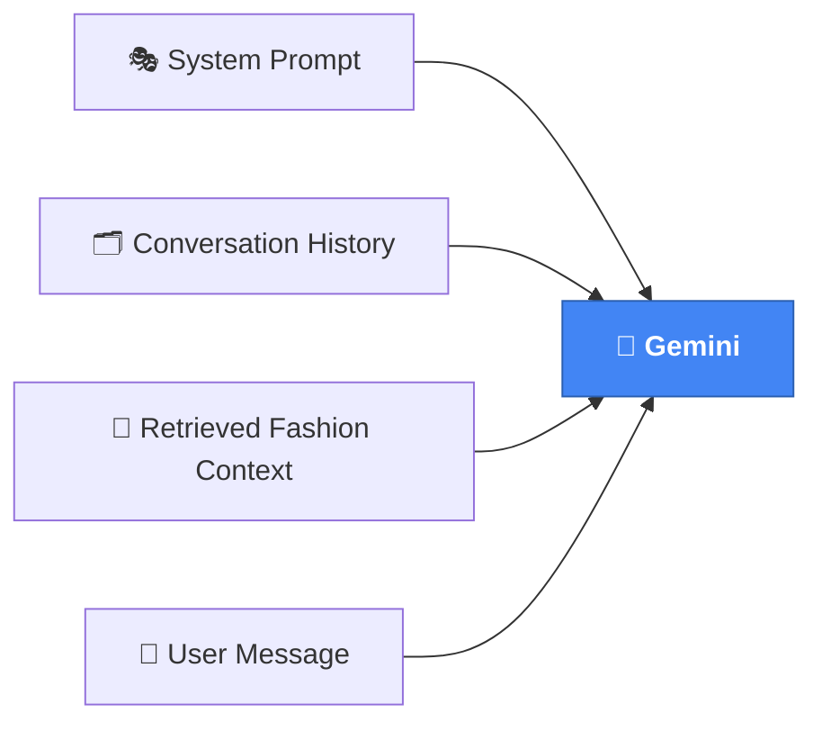
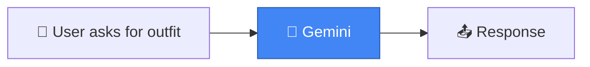
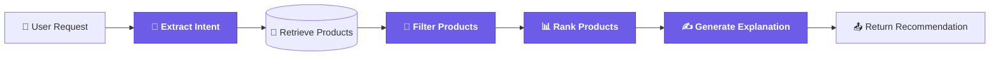

# 🧵 Miranda — Design Document

  
  
  
  

The implementation blueprint for Miranda — updated as the system grows.

 

> 📌 **This is a living document.** Unlike `ARCHITECTURE.md`, which describes the overall system shape, this file is the working blueprint — the one to update every time a module's responsibilities, data, or pipeline changes.

 

## 📖 Purpose

This document defines the **detailed software design** for Miranda, an AI-powered conversational fashion assistant.

It describes:
- the responsibilities of each software module
- the flow of data between components
- the implementation decisions guiding development

Where the Architecture Document answers *"what does the system look like?"*, this document answers **"how exactly is it built?"**

 

## 🎯 Design Goals

Miranda's design is guided by six principles:

| Goal | What it means in practice |
|---|---|
| 🧩 **Modular development** | Each module can be built, tested, and replaced independently |
| 🎯 **Separation of responsibilities** | No module does more than one job |
| 🧪 **Easy testing** | Modules are small enough to unit test in isolation |
| 📈 **Future scalability** | New capabilities slot in without rewrites |
| 📖 **Readable code** | Anyone should be able to follow the logic without a walkthrough |
| 🔌 **Extensible AI capabilities** | New models, tools, or data sources can be swapped in |

 

---

## 🧩 Module Design

Each module below has a single job. This section is the first place to update whenever a responsibility shifts.

### 🧠 Agent — `src/agents/`

**Purpose:** Acts as the central controller.

| | |
|---|---|
| **Receives** | User input |
| **Builds** | Prompts |
| **Coordinates** | All other modules |
| **Returns** | Final responses |

---

### 🎭 Personality — `src/prompts/`

**Purpose:** Defines Miranda's behavior and voice.

Responsibilities:
- Tone
- Writing style
- Fashion expertise
- Response formatting

---

### 🗂️ Memory — `src/memory/`

**Purpose:** Maintains conversation context.

**Stores:**
- Conversation history
- User preferences
- Style preferences
- Favorite colors
- Budget
- Occasion history

| Status | Implementation |
|---|---|
| ✅ Current | Session memory |
| 🔜 Future | Persistent user memory |

---

### 🔎 Retrieval — `src/retrieval/`

**Purpose:** Searches the fashion dataset.

Future features:
- Similar products
- Semantic search
- Vector retrieval
- Metadata filtering

---

### 👁️ Vision — `src/vision/`

**Purpose:** Analyzes clothing images.

Future tasks:
- Clothing classification
- Color extraction
- Style recognition
- Similar outfit search

 

---

## 🗃️ Data Models

Two core entities anchor Miranda's data layer today. This section grows as new models are introduced.

 

---

## 🔄 System Data Flow

How a single request travels through Miranda end-to-end.

### Prompt Composition

What actually gets assembled and sent to Gemini:

 

---

## 🧠 Memory Design

What Miranda should remember — split by how long it should stick around.

| Term | Contents |
|---|---|
| **Short-term** | Current conversation |
| **Long-term** | Favorite brands · clothing sizes · favorite colors · fashion goals · budget · preferred stores · seasonal preferences |

> 💡 You don't have to implement all of this yet — the point of this section is to **define the target shape** of memory so future work has a clear destination.

 

---

## 🚀 Recommendation Pipeline

The heart of Miranda, shown at two stages of maturity.

**Today:**

**Where it's heading:**

The gap between these two diagrams **is the roadmap** — each new box is a future unit of work.

 

---

## 📊 Dataset Design

Core attributes the fashion dataset should expose, to make preprocessing straightforward later.

| Attribute | Notes |
|---|---|
| Product ID | Unique identifier |
| Category | Top-level grouping (e.g. tops, shoes) |
| Subcategory | Finer grouping (e.g. sneakers, boots) |
| Brand | — |
| Color | — |
| Season | Spring / Summer / Fall / Winter |
| Material | — |
| Gender | Target demographic |
| Usage | Casual / Formal / Sports / etc. |
| Price | — |
| Image Path | Local or remote reference |

 

---

## 🗺️ Future Modules

A living roadmap — check items off as they land, add new ones as they emerge.

- [ ] Wardrobe Manager
- [ ] Trend Analysis
- [ ] Weather API
- [ ] Shopping APIs
- [ ] Virtual Try-On
- [ ] Outfit Rating
- [ ] Multi-Agent Collaboration

 

---

## 🧾 Coding Standards

Boring until you're debugging at 2 a.m. — worth defining now.

- One responsibility per module
- Type hints where practical
- Meaningful function names
- Keep modules focused
- Write docstrings for public functions
- Avoid hard-coded values — use configuration files where appropriate

 

---

## ⚠️ Known Limitations

Transparency about what isn't built yet, so nobody (including future-you) assumes otherwise.

- No persistent memory *(yet)*
- Recommendations are not yet ranked using machine learning
- Computer vision is planned but not implemented
- Fashion knowledge currently depends on the integrated dataset and LLM reasoning

 

---

This document evolves with Miranda — update it before the code drifts from the plan. 🧷

